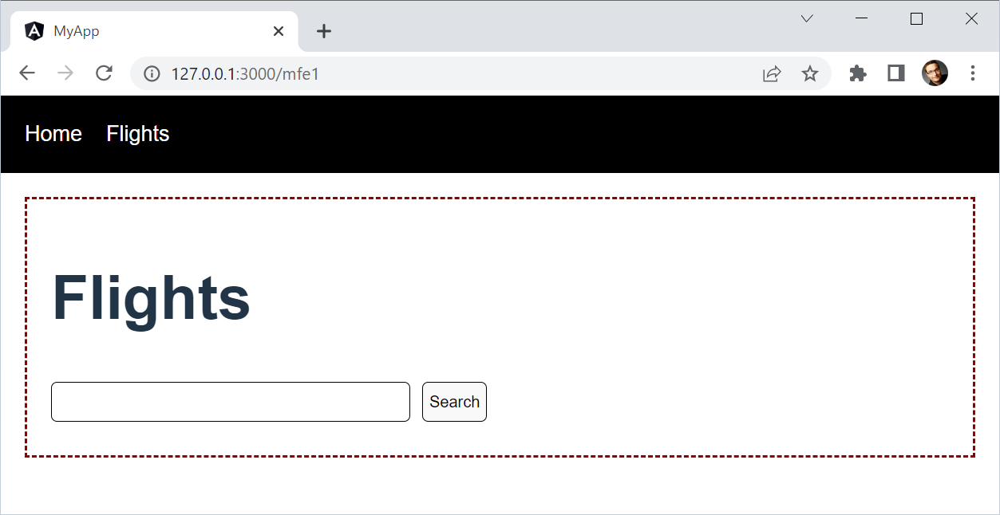

# Example: Micro Frontends with Native Federation + vite + Angular powered by AnalogJS

The section between the dashed lines is a separately compiled and deployed Micro Frontend:



## Install and Run

Repeat this for both, the ``shell`` and the ``mfe1`` folder:

```
npm i
npm run dev
```

## Inspect the Examples

- ``vite.config.ts``: Here, the federation-vite-plugin is used and the dev server is configured to allow access to the ``shared`` folder
- ``federation.config``: Native Federation config
- ``index.html``: Here, the polyfill for Import Maps is registered
- ``main.ts``: Initializes Native Federation and then (!) imports ``bootstrap.ts`` for starting the application
